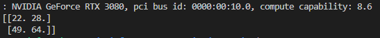
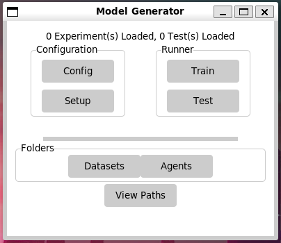
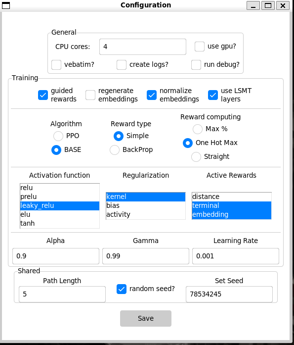
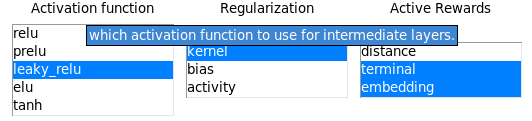
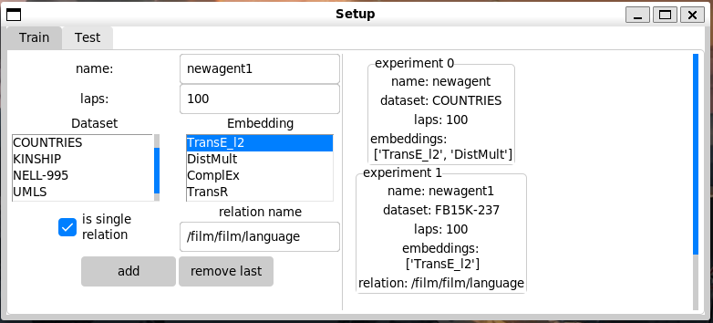
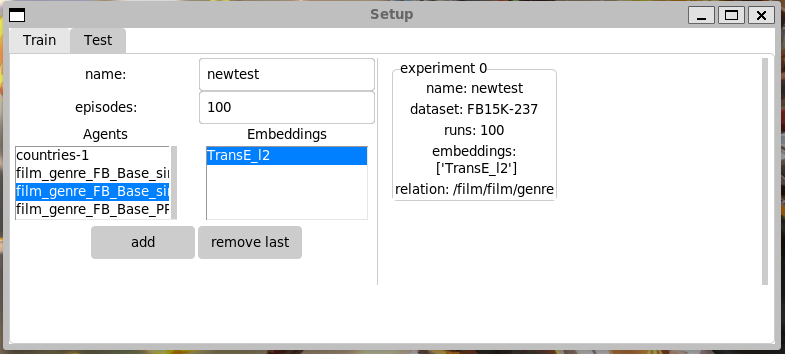
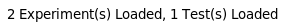
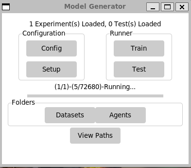

# SpaceRL-KG (Logo)

<p></p>

# Introduction

RLKG is an end-to-end framework which aids with generating new relations in knowledge graphs by leveraging on Reinforcement Learning techniques and algorithms.  
RLKG recieves any formatted dataset as input and provides embedding representations, usable agents, graphic information and an deployable API.  
With an easy to use GUI that helps users makes sense of the multitude of options that these types of frameworks usually present.  

RLKG was built and is mantained by [**DEAL research group**](https://deal.us.es/) as a tool for researchers which would want to further investigate these topics, or users which would like to use these agents for any purpose, such as inteligent recomendations, knowledge discovery, etc...

<br>  

# Contents
- [Requirements](#requirements)  
  * [Windows](#windows)  
  * [Linux](#linux)
- [Instalation](#instalation)
- [Configuration](#configuration)
  * [General](#general-parameters)
  * [Training](#training-specific-parameters)
  * [Shared](#shared-params)
- [Setup](#setup)
- [Running](#running)
    * [Format](#format)
    * [Execution](#execution)
        + [Manual](#manual-execution)
        + [GUI](#gui)
        + [API](#api)
    * [Results](#results)
    * [Miscellaneous](#miscellaneous)
        + [Embeddings preprocess](#embeddings-preprocessing)
        + [Fake dataset generation](#fake-dataset-generation)
        + [Plotting](#plotting)
- [Visualization](#visualization)


<br>

# Requirements
This software can be run in Windows (>= 7) or Linux (Ubuntu >=20.04)

It is compatible with any version of **python 3.8** as in depends on [**DGL-KE**](https://aws-dglke.readthedocs.io/en/latest/) for embedding generation.  

If embedding generation is done beforehand, you can safely use **python >= 3.8.**

NOTE: Ubuntu 20.04 uses python 3.8 as the base python distribution, you can otherwise install another python distribution by running:

```
sudo add-apt-repository ppa:deadsnakes/ppa
sudo apt-get update
sudo apt-get install python3.8
```

you will need to run the command `python3.8` XXX.py instead of python3 XXX.py

---

The software supports multiple GPUs for agent training and testing, to take advantage of this you'll need to install the latest version of your NVIDIA drivers, that can be obtained [**here**](https://www.nvidia.es/Download/index.aspx) for windows or run the following commands in Linux

```
sudo add-apt-repository ppa:graphics-drivers/ppa
sudo apt install nvidia-driver-XXX
```
replace XXX with the appropiate version for your graphics card.
check the possible versions with `nvidia-smi`, once installed it will display gpu information.

---

```
NOTE: we higly encourage the use of a virtual environment, you can get it with pip

python3 pip -m install --user virtualenv
virtualenv <env_name> 

To activate them run:
. <env_name>/bin/activate (Linux)
<env_name>/Scritps/activate (Windows)

```
---
**Pytorch** is required for embedding generation, they have CUDA compatibility out of the box and it can installed via pip with the following commands, or you can install it manually from their [**website**](https://pytorch.org/get-started/locally/)

`pip3 install torch==1.13.0 torchvision torchaudio --extra-index-url https://download.pytorch.org/whl/cu116`

**Tensorflow** is used for agent training, we highly recommend using version 2.8, cuDNN version 8.1.1, and MS Visual Studio 2019 (Windows only). 

## Windows
you can get CUDA binaries from their [**website**](https://developer.nvidia.com/cuda-11.2.2-download-archive)  
cuDNN from [**NVIDIAs developer site**](https://developer.nvidia.com/rdp/cudnn-archive) (account required.)  
Visual Studio from [**microsofts website**](https://my.visualstudio.com/Downloads?PId=8228)  

First run the cuda toolkit > Agree and continue > Express (Recommended)

Then extract cuDNN zip and copy the files into the following folder:  
`C:/Program Files/NVIDIA GPU Computing Toolkit/CUDA/v11.2`

You will need to manually add `C:/Program Files/NVIDIA GPU Computing Toolkit/CUDA/v11.2\bin` to the windows path, you can do so by following the instructions [**here**](https://www.computerhope.com/issues/ch000549.htm).

Lastly you need to install tensorflow, activate the virtual environment we setup earlier and run `pip install tensorflow==2.8`

[Verify install](#verify-install)

## Linux
First we will get CUDA by running the following commands in a terminal


```
wget https://developer.download.nvidia.com/compute/cuda/repos/ubuntu2004/x86_64/cuda-ubuntu2004.pin

sudo mv cuda-ubuntu2004.pin /etc/apt/preferences.d/cuda-repository-pin-600

wget https://developer.download.nvidia.com/compute/cuda/11.2.0/local_installers/cuda-repo-ubuntu2004-11-2-local_11.2.0-460.27.04-1_amd64.deb

sudo dpkg -i cuda-repo-ubuntu2004–11–2-local_11.2.0–460.27.04–1_amd64.deb

sudo apt-key add /var/cuda-repo-ubuntu2004–11–2-local/7fa2af80.pub

sudo apt-get update

sudo apt-get -y install cuda
```

Second we will get cuDNN, again, by running these commands

```
wget https://developer.nvidia.com/compute/machine-learning/cudnn/secure/8.1.1.33/11.2_20210301/cudnn-11.2-linux-x64-v8.1.1.33.tgz

tar -xzvf cudnn-11.2-linux-x64-v8.1.1.33.tgz

sudo cp cuda/include/cudnn.h /usr/local/cuda/include

sudo cp cuda/lib64/libcudnn* /usr/local/cuda/lib64

sudo chmod a+r /usr/local/cuda/include/cudnn.h /usr/local/cuda/lib64/libcudnn*

```

We will need to modify the path, by chaning the .bashsrc file with `gedit .bashsrc`, add the following lines to the file and save it.

```
export LD_LIBRARY_PATH=/usr/local/cuda-11.2/lib64:$LD_LIBRARY_PATH

export LD_LIBRARY_PATH=/usr/local/cuda/lib64:$LD_LIBRARY_PATH
```

Finally to install tensorflow in your virtual environment run `pip install tensorflow==2.8`

--- 
## Verify install

check that the CUDA installation was succesfull by running `nvidia-smi`

you can also run the following python code:

```
import tensorflow as tf

tf.compat.v1.disable_eager_execution()

with tf.device('/gpu:0'):
    a = tf.constant([1.0, 2.0, 3.0, 4.0, 5.0, 6.0], shape=[2, 3], name='a')
    b = tf.constant([1.0, 2.0, 3.0, 4.0, 5.0, 6.0], shape=[3, 2], name='b')
    c = tf.matmul(a, b)

with tf.compat.v1.Session() as sess:
    print (sess.run(c))

```
you should see something similar to this output:

  

congratulations! this means you have cuDNN compatible tensorflow installed.


<br>

# Instalation

First clone or download this repository in the same folder as your virtual environment and move the environment folder into this one, so that it looks similar to this.

```
📦RL-KG  
 ┣ 📂GUI  
 ┃ ┣ 📜main.py  
 ┃ ┣ ...  
 ┣ 📂datasets  
 ┃ ┣ 📂COUNTRIES  
 ┃ ┃ ┣ 📜graph.txt  
 ┃ ┣ 📂FB15K-237  
 ┃ ┣ 📂KINSHIP  
 ┃ ┣ 📂NELL-995  
 ┃ ┣ 📂UMLS  
 ┃ ┣ 📂WN18RR  
 ┃ ┣ 📜README.MD  
 ┣ 📂<env_name> <----- your virtual environment.
 ┣ 📂model  
 ┃ ┣ 📂data  
 ┃ ┃ ┣ 📂agents  
 ┃ ┃ ┣ 📂caches  
 ┃ ┃ ┣ 📂debug  
 ┃ ┃ ┣ 📂generator  
 ┃ ┃ ┣ 📂logs  
 ┃ ┃ ┣ 📂results  
 ┃ ┃ ┣ 📜data_manager.py  
 ┃ ┃ ┣ 📜data_processor.py  
 ┃ ┃ ┗ 📜kg_structure.py  
 ┃ ┣ 📜agent.py  
 ┃ ┣ 📜config.py  
 ┃ ┣ 📜environment.py  
 ┃ ┣ 📜tester.py  
 ┃ ┣ 📜trainer.py  
 ┃ ┗ 📜utils.py  
 ┣ 📂plotters  
 ┣ 📜.gitignore  
 ┣ 📜README.MD  
 ┗ 📜requirements.txt  
 ```

open a terminal in the main folder, activate the environment and install the dependencies with  

`(sudo) pip(3[.8]) install -r requirements.txt`

operations in parenthesis are required for linux only.
operation in brackets are for versions other tan Ubuntu 20.04

# Configuration
By modifying the `config.py` file you can alter the default configurations of the project, this is important if you plan to run it manually instead of using the API or the GUI.

The config file contains 3 main parts the config dict, the experiment list and the training list. First we will focus on the config dict and its parameters, which can also be separated into 3 sections:

## General parameters

    "available_cores" (int) -> Number of cpu cores to use when computing the reward
    "gpu_acceleration" (bool) -> wether to use GPU(S) to perform fast training & embedding generation.
    "verbose": (bool) -> Prints detailed information every episode.
    "log_results": (bool) -> Logs the results in the logs folder of episode training.
    "debug": (bool) -> offers information about crashes, runs post-mortem
    "print_layers": (bool) -> if debug is active wether to print the layer wheights on crash info.
    
## Training specific parameters
    
    "restore_agent" (bool) -> continues the training from where it left off and loads the agent if possible.
    "guided_reward" (bool) -> Wether to follow a step-based reward or just a reward at the end of the episode.

    if guided rewards are active, which one(s) to use:
    distance: computes the distance to the final node and gives a score based on it.
    embedding: based on the similarity to the end node we reward the agent.
    terminal: reward if we are on the final node, 0 otherwise.
    "guided_to_compute" (list) -> distance, terminal, embedding

    "regenerate_embeddings" (bool) -> If embedding is found and true re-calculates them.
    "normalize_embeddings" (bool) -> If re-calculation is active, normalizes embedding values to be on the center of the N-dim embedding array as well as normalizing its stdev based on the whole dataset embedding values.

    LSTM layers allow the traine agents to leverage on the previous steps its recommended to always leave this on unless to perform an ablation study.
    "use_LSTM": (bool) -> Wether to add LSTM layers to the model

    "use_episodes": (bool) -> If True will train for N episodes otherwise it will loop over the dataset for an ammount defined in the laps attribute of the training.
    "episodes": (int) -> Number of episodes to run.
    "alpha" (float) -> [0.8-0.99] previous step network learning rate (for PPO only.) 
    "gamma" (float) -> [0.90-0.99] decay rate of past observations for backpropagation
    "learning_rate" (float) -> [1e-3, 1e-5] neural network learning rate.

    activation function for intermediate layers
    "activation" (string) -> relu, prelu, leaky_relu, elu, tanh
    
    applies L1 and L2 regularization at different stages of training.
    "regularizers" (list) -> kernel, bias, activity 

    PPO uses actor critic networks and BASE is a simple feed-forward network. you can then choose retropropagation of rewards to compute as a REINFORCE model or simple to keep the rewards based on the results of the episode without adding any aditional computation to the reward.
    "algorithm" (string) -> BASE, PPO

    Retroprogation causes the rewards closer to the end of the episode have more influence over the neural network, whereas simple offers a homogenous distibution.
    "reward_type" (string) -> retropropagation, simple
    
    probability: action calculation biased by the probability of the network output.
    max: pick the highest value offered by the network.
    "action_picking_policy" (string) -> probability, max

    modifies how the y_true value is calculated.
    max_percent: computes the maximum reward for the step and gives 0-1 according to how close we got to it.
    one_hot_max: gives 1 if we got the maximum reward for the episode 0 otherwise
    straight: gives the reward straight to the network as calculated from the step.
    "reward_computation" (string) -> max_percent, one_hot_max, straight
    
## Shared params
    "path_length"(int) -> [2,10] the length of path exploration.  
    "random_seed" (bool) -> set a random seed, if false the following set seed wll be used.  
    "seed":78534245 (int) -> sets the seed to this number. This allows for repeatability in experimentation.  

# Setup

To add experimentation and training instances into the config file we can add them to the `EXPERIMENT` and `TEST` lists, using the following format

```
EXPERIMENTS = [
    Experiment("<experiment_name>", "<dataset_name>", ["<embedding_name_1>","<embedding_name_2>"], <laps>), 
    Experiment("<experiment_name>", "<dataset_name>", ["<embedding_name>"], <laps> , <is_single_relation>,
    relation = "<relation_name"),
]

TESTS = [
    Test("<test_name>", "<agent_name>", ["<embedding_name_1>","<embedding_name_2>"], <runs>),
    ...
]

```

There are two types of experimentation, **complete dataset agent** or **relation specific** agent. The first one focuses on creating an agent who explores the complete scope of the dataset and is able to generate information about any query that is presented to it. The second is meant to be specific and its tailored to answer querys only related to the specific knowledge that we train it for.

For example, we can train a generalistic agent to relay knowledge in a small dataset about family connections between generations, there is no need to specify wether the connection to a family member is that of a sibling or a parent, the agent should be able to discern it. On the other hand, if we desire to obtain information related to which genre a certain movie might have in a dataset containing all the info about the cast, sound team, writing, direction etc... We do need to focus on the genre specifically.

<br>

# Running

## Format
The software is end-to-end, meaning that only the dataset need to be provided, it relies on graph connectivity so no node descriptions or information is leveraged, making it perfect for graphs which are sparse on node information. The dataset format is as follows.

```
node1   rel1    node2
node1[\t]rel1[\t]node2[\n]
...
```

The separators \t and \n indicate a tabulation and a newline characters.  
The name of the dataset must be specified as a child directory to `datasets` which contains a `graph.txt` file with the complete dataset information.

## Execution

The software can be executed in 2 separate ways, manually running the testing and training suites or using the GUI.

You can also deploy an API to allow external users the creationg of these models (WIP).

### Manual execution
To run the program manually, you can run the `trainer.py` and `tester.py` files. These files will read the information from `config.py` so, change it accordingly beforehand.

The first will run all the experiments you setup in the **EXPERIMENT** list in the `config.py` file and the second will run every test defined in the **TESTS** list.

### GUI
To run the GUI run the `main.py` file in the GUI folder, you will see the following:  
  

The top text indicates how many Tests and Experiments are loaded.

The configuration submenu allows for the modification of the information thats is contained in the config.py file. Each button opens another menu that allows for customizing the different parts of this file, the **config** button opens the config menu:

  

These are the same options that are contained in the config dict, You can hover over them to see further descriptions of each:

  

The setup windows contains 2 submenus Train (default) and Test which represent the EXPERIMENT and TESTS lists we previously mentioned.  
The **train** window contains the following parameters.
- name: which name to save the agent with.
- laps: number of times to iterate over the dataset.
- Dataset: which dataset to create an agent for.
- Embedding: which embeddings to train with (multiple selection)
- is_single_relation: wether to create a general purpose agent (entire graph) or a single relation focused agent.
- relation_name: if the agent is relation based, which one to train for.

  

you can add as many experiments as you want, they will appear in the window of the left as seen in the image above.

The **Test** window contains these parameters.
- name: the name to save the test with.
- episodes: number of paths to calculate.
- Agents: the trained agents you can test.
- Embeddings: the available embeddings for the selected agent, it changes based on the previous param.

  

when this window is closed the main window text will update to show the loaded tests and experiments defined in the previous windows.

  

the train and test buttons then runs the main functions of the respective `trainer.py` and `tester.py` files and links it with the main window to update a progress bar and text.

  

Once finished the progress bar will be filled and a message displaying that the execution is finished will pop up.

### API

WIP


## Results
the trainer will create agents in the `model\data\agents` folder accordingly. Each agent generated contains the following
- **config_used.txt** which is used in testing, to avoid pulling from the config file which could be modified.
- \[1-4\] <dataset_name>-<embedding_name>.h5 file(s) or \[1-4\] folder(s) with `actor.h5` and `critic.h5` inside them. Folders are generated if PPO is selected as the algorithm and files are generated otherwise.

The second file will run tests using the generated agents and the specifications in the TESTS lists in the `config.py` file. it will generate a folder for each test in the `model\data\results` folder, each of these will contain 3 files:
- **metrics.csv** -> it contains the Hits@1,3,5,10 and the Mean Reciprocal Rank for each of the embeddings that were tested for each agent.
- **paths.txt** -> it contains the paths that have been generated during testing, this information is used for visualization of generated knowledge.
- res.txt -> the # of tries it took for the agent to reach the tail entity, 0 indicates it didn't reach it.

## Miscellaneous
### Embeddings preprocessing.
You can pre-process the generation of embeddings by running `model\data\generator\generate_trans_embeddings.py` directly, modify the list at the bottom of the file to configure what datasets to generate ALL embeddings for and how.

```
# YOU CAN RUN THIS DIRECTLY TO GENERATE ALL THE POSSIBLE EMBEDDINGS AND AVOID WAITING IN THE FUTURE FOR ANY NEW ONES.
if __name__ == "__main__":
    use_gpu, regenerate_existing , fast_mode = True, False, False

    # add or remove the datasets you want to generate embeddings for.
    datasets = ["COUNTRIES", "FB15K-237", "KINSHIP", "NELL-995", "UMLS", "WN18RR"]
    for d in datasets:
        generate_embedding(d, [], use_gpu, regenerate_existing, normalize=True,
        add_inverse_path=True, fast_mode=fast_mode)
```
use_gpu -> wether to use GPU or CPU to generate the embeddings  
regenerate_existing -> recalculates the embeddings that have already been generated.
fast_mode -> faster but less accurate embedding generation. (not recommended)
datasets -> which datasets to generate embeddings for.

### Fake dataset generation
You can create a fake dataset for testing the setup by running `misc\generate_fake_dataset.py`, this will create a graph.txt file in the same folder that you can use in the datasets folder as explained before.

### Plotting
WIP.  

<br>

# Visualization
WIP.
